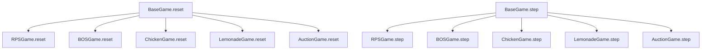
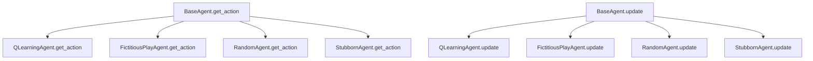

# AGT System Class Hierarchy

## Complete Class Inheritance Structure

This diagram shows the inheritance relationships between all major classes in the AGT system.

```mermaid
classDiagram
    %% Core Abstract Classes
    class BaseGame {
        <<abstract>>
        +metadata: Dict
        +reset(seed) ObsDict
        +step(actions) Tuple
        +players_to_move() List
        +num_players() int
    }
    
    class BaseAgent {
        <<abstract>>
        +name: str
        +reward_history: List
        +action_history: List
        +get_action(observation) Any
        +update(reward, info) void
        +reset() void
        +get_statistics() Dict
    }
    
    class BaseStage {
        <<abstract>>
        +game: BaseGame
        +current_stage: int
        +reset() void
        +step(actions) Tuple
        +is_done() bool
    }
    
    %% Game Implementations
    class RPSGame {
        +num_players: 2
        +actions: [rock, paper, scissors]
        +payoff_matrix: Dict
        +reset() ObsDict
        +step(actions) Tuple
    }
    
    class BOSGame {
        +num_players: 2
        +actions: [A, B]
        +payoff_matrix: Dict
        +reset() ObsDict
        +step(actions) Tuple
    }
    
    class BOSIIGame {
        +num_players: 2
        +actions: [A, B, C]
        +payoff_matrix: Dict
        +reset() ObsDict
        +step(actions) Tuple
    }
    
    class ChickenGame {
        +num_players: 2
        +actions: [swerve, straight]
        +payoff_matrix: Dict
        +reset() ObsDict
        +step(actions) Tuple
    }
    
    class LemonadeGame {
        +num_players: int
        +locations: List
        +customer_distribution: Dict
        +reset() ObsDict
        +step(actions) Tuple
    }
    
    class AuctionGame {
        +num_players: int
        +items: List
        +valuations: Dict
        +reset() ObsDict
        +step(actions) Tuple
    }
    
    class AdxOneDayGame {
        +num_players: int
        +campaigns: List
        +budgets: Dict
        +reset() ObsDict
        +step(actions) Tuple
    }
    
    class AdxTwoDayGame {
        +num_players: int
        +campaigns: List
        +budgets: Dict
        +reset() ObsDict
        +step(actions) Tuple
    }
    
    %% Agent Implementations
    class QLearningAgent {
        +q_table: Dict
        +learning_rate: float
        +discount_factor: float
        +epsilon: float
        +get_action(observation) Any
        +update(reward, info) void
        +learn() void
    }
    
    class FictitiousPlayAgent {
        +opponent_model: Dict
        +belief_distribution: Dict
        +get_action(observation) Any
        +update(reward, info) void
        +update_beliefs() void
    }
    
    class RandomAgent {
        +get_action(observation) Any
        +update(reward, info) void
    }
    
    class StubbornAgent {
        +fixed_action: Any
        +get_action(observation) Any
        +update(reward, info) void
    }
    
    class CompromiseAgent {
        +compromise_threshold: float
        +get_action(observation) Any
        +update(reward, info) void
    }
    
    %% Lab-Specific Agents
    class Lab01Agents {
        +rock_agent: RockAgent
        +paper_agent: PaperAgent
        +scissors_agent: ScissorsAgent
        +random_agent: RandomAgent
        +stubborn_agent: StubbornAgent
    }
    
    class Lab02Agents {
        +bos_finite_state: BOSFiniteStateAgent
        +bosii_competition: BOSIICompetitionAgent
    }
    
    class Lab03Agents {
        +chicken_q_learning: ChickenQLearningAgent
        +collusion_environment: CollusionEnvironmentAgent
    }
    
    class Lab04Agents {
        +lemonade_agent: LemonadeAgent
        +rl_lemonade_agent: RLLemonadeAgent
    }
    
    class Lab06Agents {
        +auction_agent: AuctionAgent
        +marginal_value_agent: MarginalValueAgent
    }
    
    %% Stage Implementations
    class MatrixStage {
        +game: MatrixGame
        +current_round: int
        +max_rounds: int
        +step(actions) Tuple
        +is_done() bool
    }
    
    class AuctionStage {
        +game: AuctionGame
        +current_round: int
        +max_rounds: int
        +step(actions) Tuple
        +is_done() bool
    }
    
    class PriceStage {
        +game: PriceGame
        +current_round: int
        +max_rounds: int
        +step(actions) Tuple
        +is_done() bool
    }
    
    class SpatialStage {
        +game: SpatialGame
        +current_round: int
        +max_rounds: int
        +step(actions) Tuple
        +is_done() bool
    }
    
    class AdxOfflineStage {
        +game: AdxGame
        +current_round: int
        +max_rounds: int
        +step(actions) Tuple
        +is_done() bool
    }
    
    %% Server Components
    class AGTServer {
        +config: Dict
        +players: Dict
        +games: Dict
        +results: List
        +start() void
        +handle_client() void
        +run_game() void
    }
    
    class Engine {
        +game: BaseGame
        +agents: List
        +rounds: int
        +run() List
        +run_single_round() Tuple
        +get_statistics() Dict
    }
    
    class PlayerConnection {
        +name: str
        +reader: StreamReader
        +writer: StreamWriter
        +address: Tuple
        +device_id: str
        +connected_at: float
        +game_history: List
        +current_game: str
    }
    
    %% Inheritance Relationships
    BaseGame <|-- RPSGame
    BaseGame <|-- BOSGame
    BaseGame <|-- BOSIIGame
    BaseGame <|-- ChickenGame
    BaseGame <|-- LemonadeGame
    BaseGame <|-- AuctionGame
    BaseGame <|-- AdxOneDayGame
    BaseGame <|-- AdxTwoDayGame
    
    BaseAgent <|-- QLearningAgent
    BaseAgent <|-- FictitiousPlayAgent
    BaseAgent <|-- RandomAgent
    BaseAgent <|-- StubbornAgent
    BaseAgent <|-- CompromiseAgent
    
    BaseStage <|-- MatrixStage
    BaseStage <|-- AuctionStage
    BaseStage <|-- PriceStage
    BaseStage <|-- SpatialStage
    BaseStage <|-- AdxOfflineStage
    
    %% Composition Relationships
    AGTServer *-- Engine
    AGTServer *-- PlayerConnection
    Engine *-- BaseGame
    Engine *-- BaseAgent
    BaseStage *-- BaseGame
```



## Method Override Patterns

### Game Method Overrides



### Agent Method Overrides



## Interface Contracts

### BaseGame Interface

```python
class BaseGame(ABC):
    @abstractmethod
    def reset(self, seed: int | None = None) -> ObsDict:
        """Initialize fresh match and return initial observations"""
        
    @abstractmethod
    def players_to_move(self) -> List[PlayerId]:
        """Return players whose actions are required now"""
        
    @abstractmethod
    def step(self, actions: ActionDict) -> Tuple[ObsDict, RewardDict, bool, InfoDict]:
        """Advance game by applying actions"""
```

### BaseAgent Interface

```python
class BaseAgent(ABC):
    @abstractmethod
    def get_action(self, observation: Dict[str, Any]) -> Any:
        """Get agent's action based on observation"""
        
    def update(self, reward: float, info: Dict[str, Any]):
        """Update agent with reward and info"""
        
    def reset(self):
        """Reset agent for new game"""
```

### BaseStage Interface

```python
class BaseStage(ABC):
    def reset(self):
        """Reset stage for new game"""
        
    def step(self, actions: ActionDict) -> Tuple[ObsDict, RewardDict, bool, InfoDict]:
        """Advance stage by applying actions"""
        
    def is_done(self) -> bool:
        """Check if stage is complete"""
```

## Design Patterns Used

1. **Template Method Pattern**: Base classes define algorithm structure, subclasses implement specific steps
2. **Strategy Pattern**: Different agent implementations can be swapped
3. **Factory Pattern**: Game and agent creation through configuration
4. **Observer Pattern**: Event-driven updates between components
5. **Adapter Pattern**: Standardized interfaces for different client types

This class hierarchy demonstrates a well-structured, extensible system that supports multiple game types and agent implementations while maintaining clean separation of concerns. 