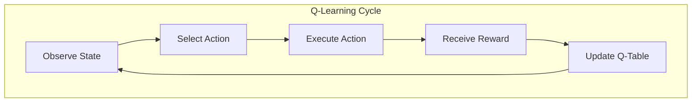
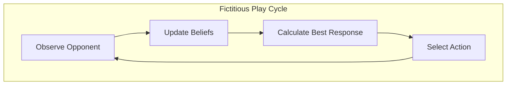
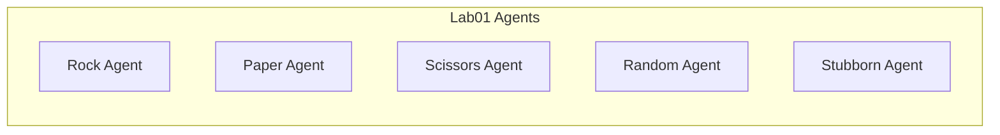
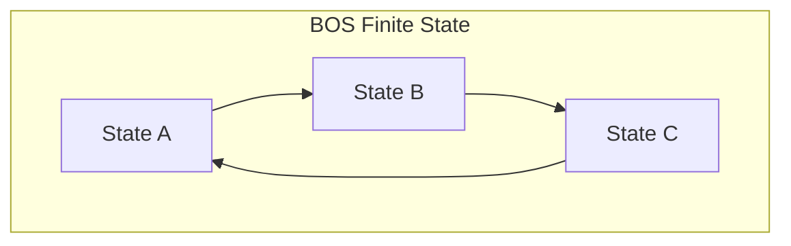
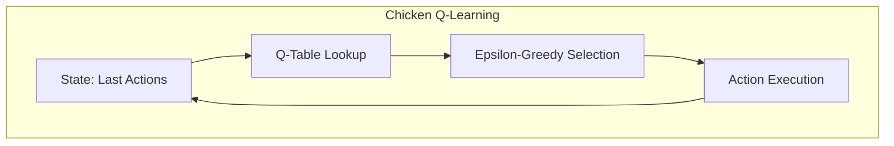
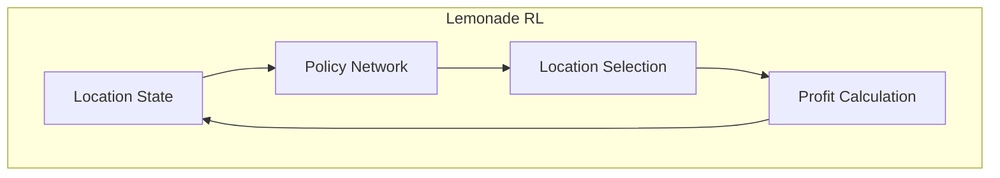
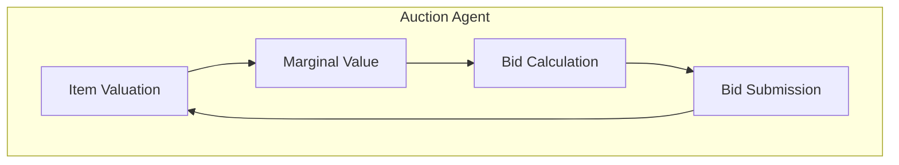

# Agent System

## Agent Hierarchy

All agents inherit from the BaseAgent abstract class:

```mermaid
graph TD
    BA[BaseAgent] --> QA[QLearningAgent]
    BA --> FA[FictitiousPlayAgent]
    BA --> RA[RandomAgent]
    BA --> SA[StubbornAgent]
    BA --> CA[CompromiseAgent]
    
    subgraph "Agent Interface"
        AI1[get_action()]
        AI2[update()]
        AI3[reset()]
    end
    
    BA -.-> AI1
    BA -.-> AI2
    BA -.-> AI3
```

## Learning Strategies

### Q-Learning (Lab03)

Reinforcement learning approach for repeated games:



### Fictitious Play (Lab01)

Belief-based learning approach:



## Lab-Specific Agents

### Lab01: Basic Game Theory



### Lab02: Finite State Machines



### Lab03: Q-Learning



### Lab04: Reinforcement Learning



### Lab06: Auction Bidding



## Agent Characteristics

| Agent Type | Learning Method | Best For | Complexity |
|------------|-----------------|----------|------------|
| Random | None | Baseline | Low |
| Stubborn | None | Fixed strategy | Low |
| Fictitious Play | Belief updating | Matrix games | Medium |
| Q-Learning | Reinforcement | Repeated games | High |
| Custom | Various | Specific scenarios | Variable | 