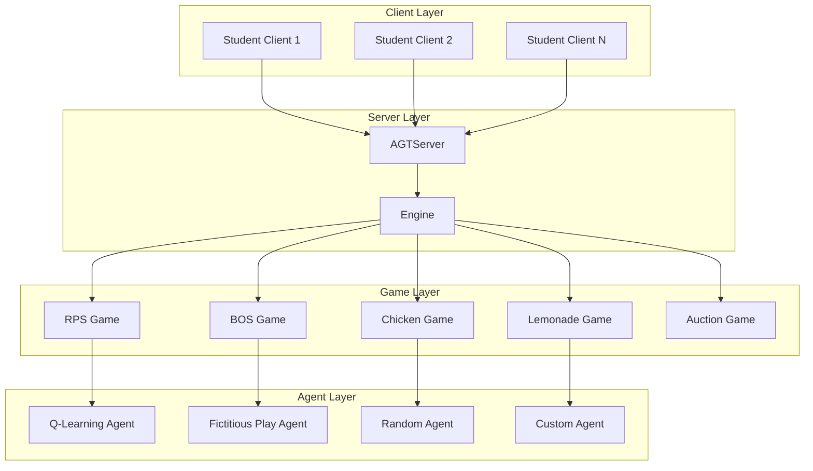
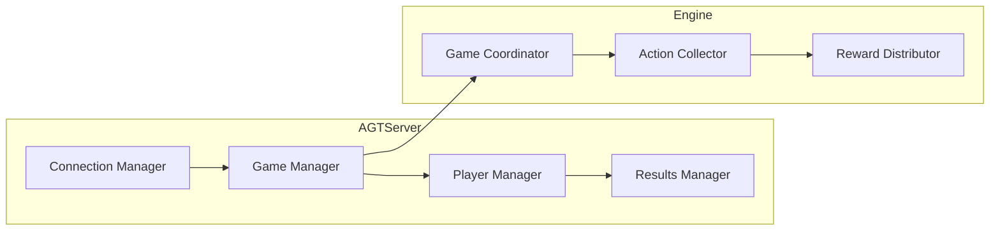
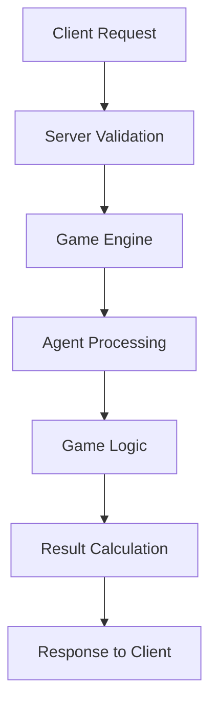

# System Architecture

## High-Level Architecture

The AGT Server follows a layered architecture pattern with clear separation of concerns.

## Server Components

The main server is composed of several key components:

## Data Flow

How data flows through the system:

## Component Responsibilities

| Component | Responsibility |
|-----------|---------------|
| AGTServer | Client connection management, game session coordination |
| Engine | Game execution, action collection, reward distribution |
| BaseGame | Game state management, rule enforcement |
| BaseAgent | Action selection, learning, state tracking |
| Stage | Multi-phase game management | 