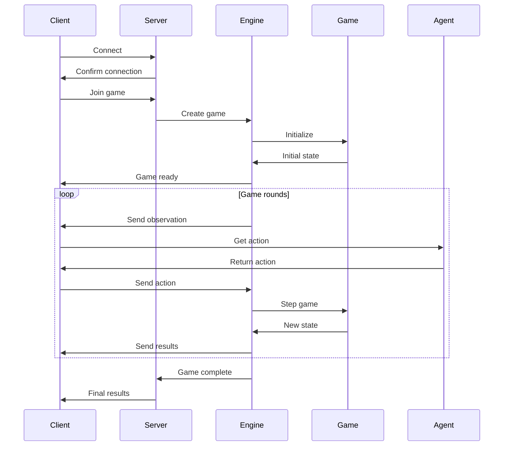
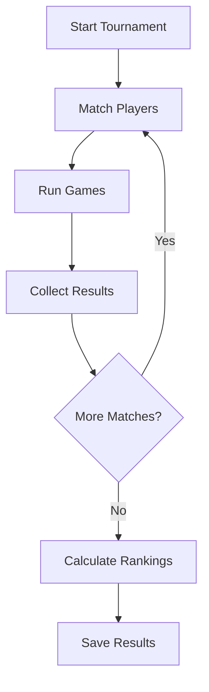
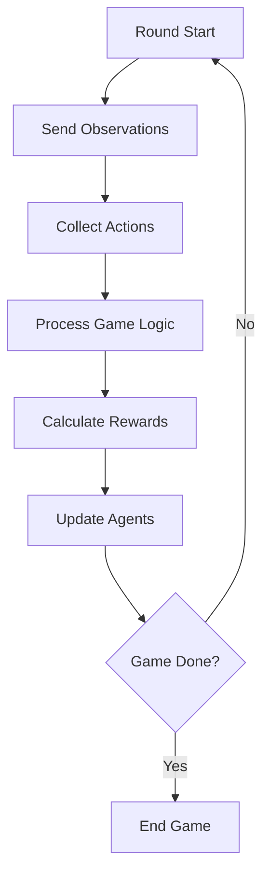
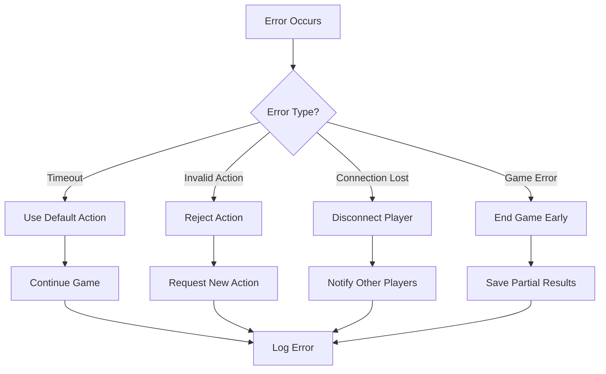
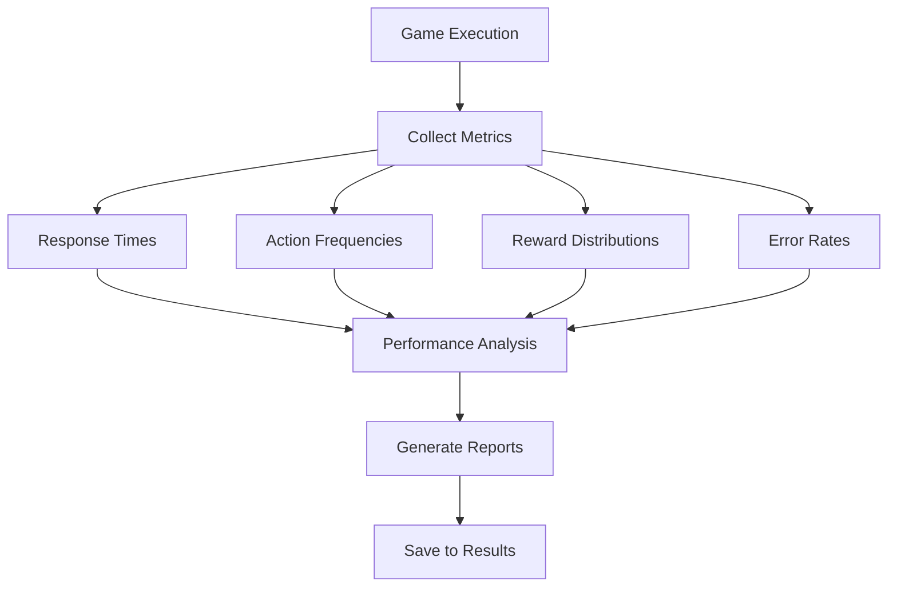
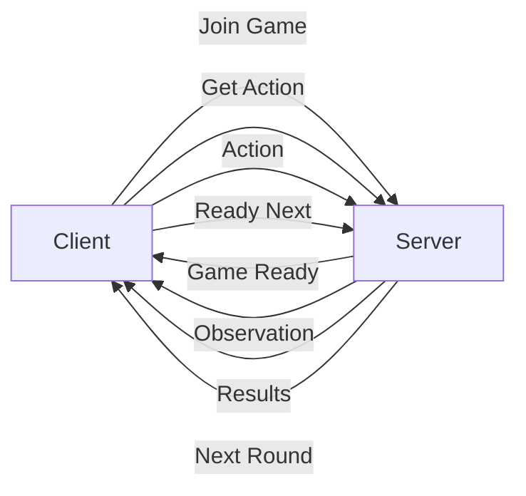

# Execution Flow

## Game Session Sequence

The typical flow of a game session:

## Tournament Management

How tournaments are managed:

## Game Round Flow

Detailed flow of a single game round:

## Error Handling

How the system handles various error conditions:

## Performance Monitoring

Metrics collection during execution:

## Communication Protocol

Message flow between client and server:

## Message Types

| Message Type | Direction | Purpose |
|--------------|-----------|---------|
| Join Game | Client → Server | Request to join a game |
| Game Ready | Server → Client | Confirm game is ready |
| Get Action | Server → Client | Request action from agent |
| Action | Client → Server | Send chosen action |
| Results | Server → Client | Send game results |
| Ready Next | Client → Server | Ready for next round | 