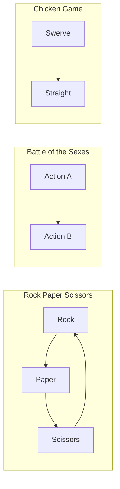
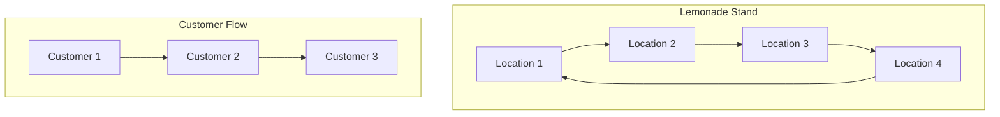
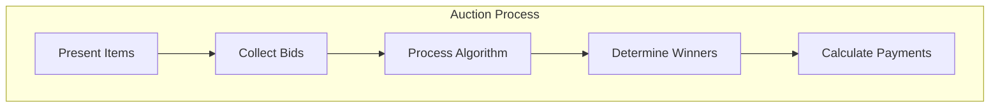

# Game System

## Game Hierarchy

All games inherit from the BaseGame abstract class:

```mermaid
graph TD
    BG[BaseGame] --> RPS[RPSGame]
    BG --> BOS[BOSGame]
    BG --> BOSII[BOSIIGame]
    BG --> CHK[ChickenGame]
    BG --> LEM[LemonadeGame]
    BG --> AUC[AuctionGame]
    BG --> ADX1[AdxOneDayGame]
    BG --> ADX2[AdxTwoDayGame]
    
    subgraph "Game Interface"
        GI1[reset()]
        GI2[step()]
        GI3[players_to_move()]
    end
    
    BG -.-> GI1
    BG -.-> GI2
    BG -.-> GI3
```

## Matrix Games (Lab01)

Simple two-player matrix games with payoff matrices:



## Spatial Games (Lab04)

Location-based games with spatial competition:



## Auction Games (Lab06)

Bidding and auction mechanisms:



## Game Characteristics

| Game Type | Players | Actions | Learning Focus |
|-----------|---------|---------|----------------|
| RPS | 2 | Rock, Paper, Scissors | Basic game theory |
| BOS | 2 | A, B | Coordination games |
| Chicken | 2 | Swerve, Straight | Conflict resolution |
| Lemonade | N | Location choice | Spatial competition |
| Auction | N | Bid amounts | Auction theory |
| AdX | N | Campaign bids | Ad exchange dynamics | 