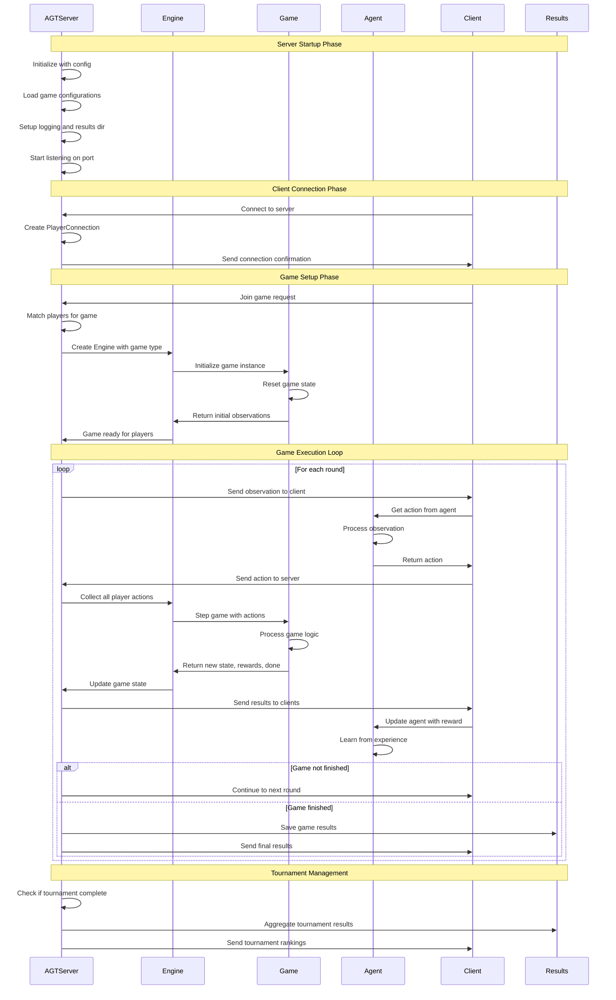
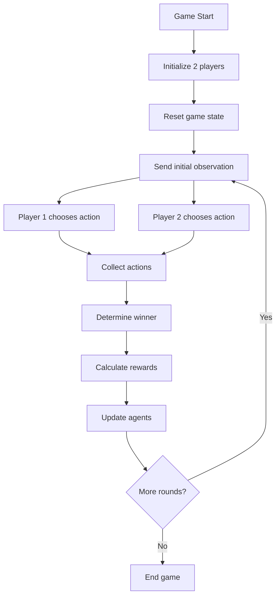
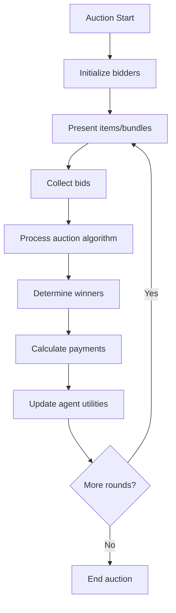
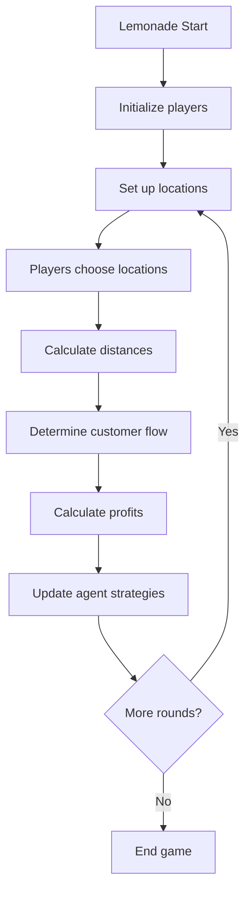
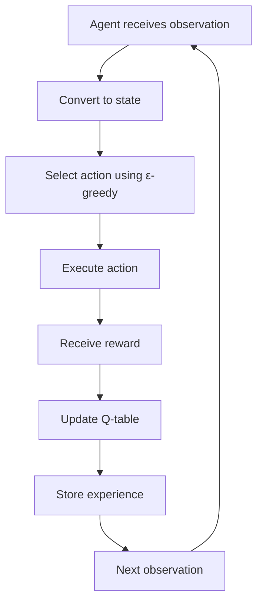
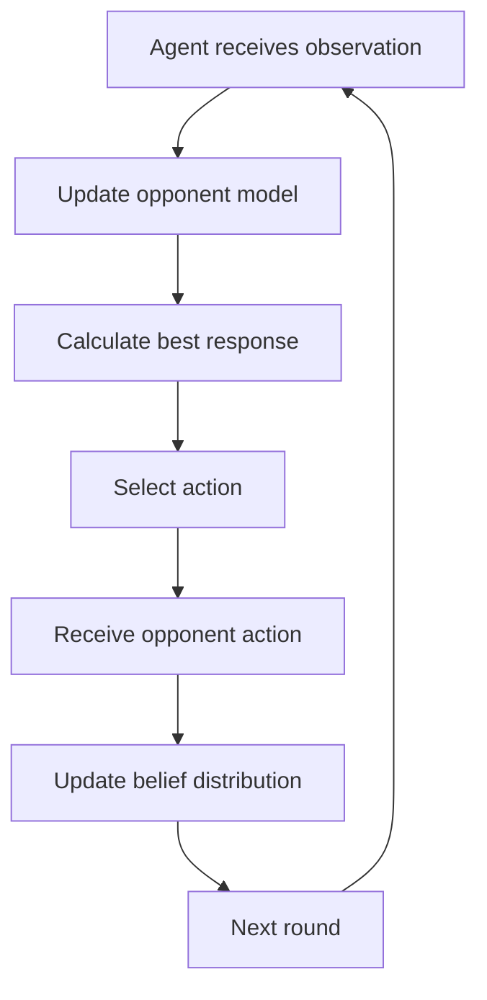
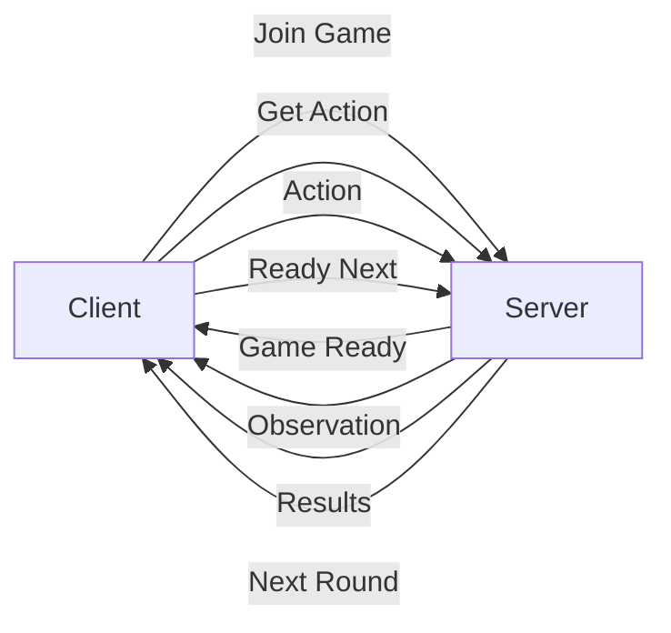
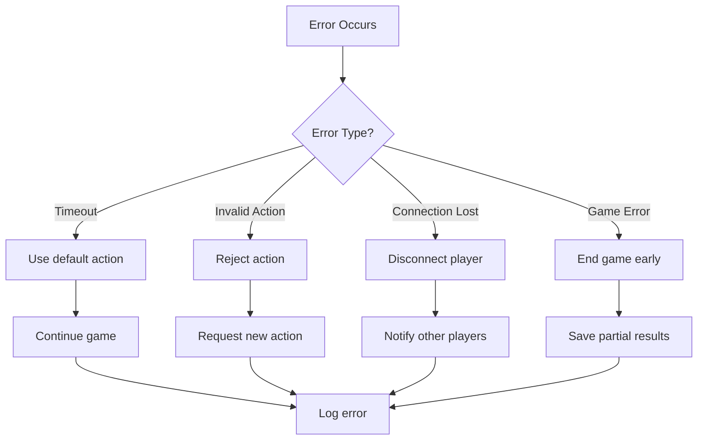
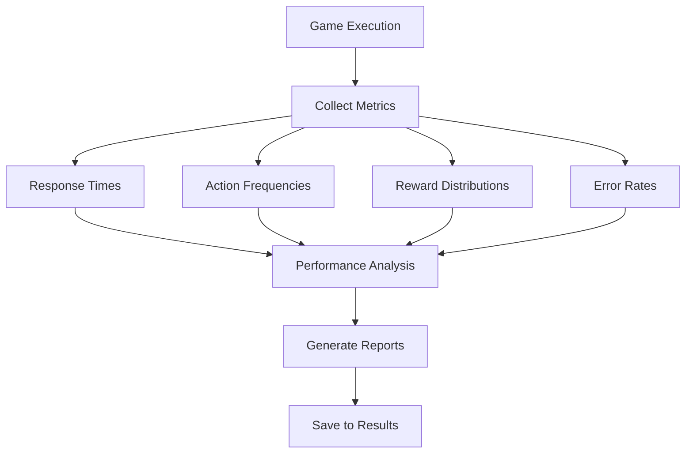

# AGT System Execution Flow

## Detailed Sequence Diagram

This diagram shows the actual execution flow of the AGT system, from server startup through game execution to result collection.

## Game-Specific Execution Flows

### Rock Paper Scissors (RPS) Flow

### Auction Game Flow

### Lemonade Stand Flow

## Agent Learning Patterns

### Q-Learning Agent (Lab03)

### Fictitious Play Agent (Lab01)

## Server Communication Protocol

### Message Flow

### Message Types

1. **Join Game**: `{"type": "join_game", "game_type": "rps"}`
2. **Get Action**: `{"type": "get_action", "observation": {...}}`
3. **Action**: `{"type": "action", "action": "rock"}`
4. **Results**: `{"type": "results", "reward": 1.0, "done": false}`
5. **Ready Next**: `{"type": "ready_next_round"}`

## Error Handling Flow

## Performance Monitoring

### Metrics Collection

This execution flow shows how the AGT system maintains a robust, scalable architecture while providing a smooth educational experience for students implementing game theory algorithms. 