# AGT Server Project Architecture Flowchart

## System Overview

This flowchart maps out the core structure of the Algorithmic Game Theory (AGT) lab system, showing how different components interact and the flow of execution.

```mermaid
graph TB
    %% Main System Components
    subgraph "AGT Server System"
        SERVER[AGTServer<br/>server/server.py]
        ENGINE[Engine<br/>core/engine.py]
        LOCAL_ARENA[LocalArena<br/>core/local_arena.py]
    end
    
    %% Game Types
    subgraph "Game Implementations"
        BASE_GAME[BaseGame<br/>core/game/base_game.py]
        RPS[RPSGame<br/>core/game/RPSGame.py]
        BOS[BOSGame<br/>core/game/BOSGame.py]
        BOSII[BOSIIGame<br/>core/game/BOSIIGame.py]
        CHICKEN[ChickenGame<br/>core/game/ChickenGame.py]
        LEMONADE[LemonadeGame<br/>core/game/LemonadeGame.py]
        AUCTION[AuctionGame<br/>core/game/AuctionGame.py]
        ADX_ONE[AdxOneDayGame<br/>core/game/AdxOneDayGame.py]
        ADX_TWO[AdxTwoDayGame<br/>core/game/AdxTwoDayGame.py]
    end
    
    %% Agent System
    subgraph "Agent System"
        BASE_AGENT[BaseAgent<br/>core/agents/common/base_agent.py]
        Q_LEARNING[Q-Learning<br/>core/agents/common/q_learning.py]
        
        subgraph "Lab Agents"
            LAB01_AGENTS[Lab01 Agents<br/>RPS, BOS, Chicken]
            LAB02_AGENTS[Lab02 Agents<br/>BOS Finite State]
            LAB03_AGENTS[Lab03 Agents<br/>Chicken Q-Learning]
            LAB04_AGENTS[Lab04 Agents<br/>Lemonade Stand]
            LAB06_AGENTS[Lab06 Agents<br/>Auction Bidding]
        end
    end
    
    %% Stage System
    subgraph "Stage System"
        BASE_STAGE[BaseStage<br/>core/stage/BaseStage.py]
        MATRIX_STAGE[MatrixStage<br/>core/stage/MatrixStage.py]
        AUCTION_STAGE[AuctionStage<br/>core/stage/AuctionStage.py]
        PRICE_STAGE[PriceStage<br/>core/stage/PriceStage.py]
        SPATIAL_STAGE[SpatialStage<br/>core/stage/SpatialStage.py]
        ADX_STAGE[AdxOfflineStage<br/>core/stage/AdxOfflineStage.py]
    end
    
    %% Client/Server Communication
    subgraph "Client Communication"
        CLIENT[Client<br/>server/client.py]
        ADAPTERS[Adapters<br/>server/adapters.py]
        CONNECT_STENCIL[Connect Stencil<br/>server/connect_stencil.py]
    end
    
    %% Configuration and Stencils
    subgraph "Configuration & Stencils"
        CONFIGS[Configs<br/>server/configs/]
        STENCILS[Stencils<br/>stencils/]
        EXAMPLES[Examples<br/>stencils/examples/]
    end
    
    %% Testing
    subgraph "Testing Framework"
        TESTS[Tests<br/>tests/]
        LAB_TESTS[Lab Tests<br/>tests/labs/]
        INTEGRATION_TESTS[Integration Tests<br/>tests/test_lab_integration.py]
    end
    
    %% Results
    subgraph "Results & Data"
        RESULTS[Results<br/>results/]
        TEST_RESULTS[Test Results<br/>test_results/]
    end
    
    %% Flow Connections
    SERVER --> ENGINE
    SERVER --> LOCAL_ARENA
    ENGINE --> BASE_GAME
    BASE_GAME --> RPS
    BASE_GAME --> BOS
    BASE_GAME --> BOSII
    BASE_GAME --> CHICKEN
    BASE_GAME --> LEMONADE
    BASE_GAME --> AUCTION
    BASE_GAME --> ADX_ONE
    BASE_GAME --> ADX_TWO
    
    ENGINE --> BASE_AGENT
    BASE_AGENT --> Q_LEARNING
    BASE_AGENT --> LAB01_AGENTS
    BASE_AGENT --> LAB02_AGENTS
    BASE_AGENT --> LAB03_AGENTS
    BASE_AGENT --> LAB04_AGENTS
    BASE_AGENT --> LAB06_AGENTS
    
    BASE_GAME --> BASE_STAGE
    BASE_STAGE --> MATRIX_STAGE
    BASE_STAGE --> AUCTION_STAGE
    BASE_STAGE --> PRICE_STAGE
    BASE_STAGE --> SPATIAL_STAGE
    BASE_STAGE --> ADX_STAGE
    
    SERVER --> CLIENT
    CLIENT --> ADAPTERS
    CLIENT --> CONNECT_STENCIL
    
    SERVER --> CONFIGS
    CONFIGS --> STENCILS
    STENCILS --> EXAMPLES
    
    SERVER --> TESTS
    TESTS --> LAB_TESTS
    TESTS --> INTEGRATION_TESTS
    
    ENGINE --> RESULTS
    SERVER --> RESULTS
    TESTS --> TEST_RESULTS
    
    %% Styling
    classDef serverClass fill:#e1f5fe,stroke:#01579b,stroke-width:2px
    classDef gameClass fill:#f3e5f5,stroke:#4a148c,stroke-width:2px
    classDef agentClass fill:#e8f5e8,stroke:#1b5e20,stroke-width:2px
    classDef stageClass fill:#fff3e0,stroke:#e65100,stroke-width:2px
    classDef configClass fill:#fce4ec,stroke:#880e4f,stroke-width:2px
    classDef testClass fill:#f1f8e9,stroke:#33691e,stroke-width:2px
    
    class SERVER,ENGINE,LOCAL_ARENA serverClass
    class BASE_GAME,RPS,BOS,BOSII,CHICKEN,LEMONADE,AUCTION,ADX_ONE,ADX_TWO gameClass
    class BASE_AGENT,Q_LEARNING,LAB01_AGENTS,LAB02_AGENTS,LAB03_AGENTS,LAB04_AGENTS,LAB06_AGENTS agentClass
    class BASE_STAGE,MATRIX_STAGE,AUCTION_STAGE,PRICE_STAGE,SPATIAL_STAGE,ADX_STAGE stageClass
    class CONFIGS,STENCILS,EXAMPLES configClass
    class TESTS,LAB_TESTS,INTEGRATION_TESTS testClass
```

## Detailed Component Descriptions

### Core System Components

1. **AGTServer** (`server/server.py`)
   - Main server that handles client connections
   - Manages game sessions and player matchmaking
   - Coordinates communication between clients and game engine
   - Handles different game types (RPS, BOS, Chicken, Lemonade, Auctions, AdX)

2. **Engine** (`core/engine.py`)
   - Core game execution engine
   - Manages game rounds and player turns
   - Handles action collection and reward distribution
   - Coordinates between games and agents

3. **LocalArena** (`core/local_arena.py`)
   - Local testing and tournament system
   - Runs multiple games between agents locally
   - Collects statistics and results

### Game System

1. **BaseGame** (`core/game/base_game.py`)
   - Abstract base class for all games
   - Defines interface: `reset()`, `step()`, `players_to_move()`
   - Handles observations, actions, rewards, and game state

2. **Game Implementations**
   - **RPSGame**: Rock Paper Scissors (2-player simultaneous)
   - **BOSGame**: Battle of the Sexes coordination game
   - **BOSIIGame**: Extended BOS with multiple equilibria
   - **ChickenGame**: Chicken game (coordination/conflict)
   - **LemonadeGame**: Lemonade stand location game
   - **AuctionGame**: Combinatorial auction bidding
   - **AdxOneDayGame/AdxTwoDayGame**: Ad Exchange games

### Agent System

1. **BaseAgent** (`core/agents/common/base_agent.py`)
   - Abstract base class for all agents
   - Defines interface: `get_action()`, `update()`, `reset()`
   - Maintains action and reward history

2. **Agent Categories**
   - **Lab01**: Basic game theory agents (RPS, BOS, Chicken)
   - **Lab02**: Finite state machine agents for BOS
   - **Lab03**: Q-learning agents for Chicken game
   - **Lab04**: Reinforcement learning for Lemonade stand
   - **Lab06**: Auction bidding strategies

### Stage System

1. **BaseStage** (`core/stage/BaseStage.py`)
   - Abstract base for game stages/phases
   - Handles stage transitions and state management

2. **Stage Types**
   - **MatrixStage**: Matrix game stages
   - **AuctionStage**: Auction bidding stages
   - **PriceStage**: Price setting stages
   - **SpatialStage**: Spatial location games
   - **AdxOfflineStage**: Ad Exchange offline stages

### Client Communication

1. **Client** (`server/client.py`)
   - Client-side communication interface
   - Handles connection to server and message passing

2. **Adapters** (`server/adapters.py`)
   - Protocol adapters for different client types
   - Standardizes communication format

3. **Connect Stencil** (`server/connect_stencil.py`)
   - Template for client connections
   - Provides standard interface for student implementations

### Configuration & Stencils

1. **Configs** (`server/configs/`)
   - JSON configuration files for each lab
   - Defines game parameters, rules, and settings

2. **Stencils** (`stencils/`)
   - Student assignment templates
   - Contains incomplete implementations for students to complete

3. **Examples** (`stencils/examples/`)
   - Complete example solutions
   - Reference implementations for each lab

### Testing Framework

1. **Tests** (`tests/`)
   - Comprehensive testing suite
   - Unit tests for individual components
   - Integration tests for full system

2. **Lab Tests** (`tests/labs/`)
   - Lab-specific test cases
   - Validates student implementations

### Results & Data

1. **Results** (`results/`)
   - Game results and statistics
   - Tournament outcomes and rankings

2. **Test Results** (`test_results/`)
   - Automated test results
   - Performance metrics and validation data

## System Flow

1. **Server Startup**: AGTServer initializes with configuration
2. **Client Connection**: Students connect via client interface
3. **Game Selection**: Server matches players for specific game types
4. **Game Execution**: Engine runs games between agents
5. **Action Processing**: Agents provide actions based on observations
6. **State Updates**: Games update state and provide rewards
7. **Result Collection**: Statistics and results are collected
8. **Tournament Management**: Multiple games form tournaments

## Key Design Patterns

- **Strategy Pattern**: Different agent implementations
- **Factory Pattern**: Game and agent creation
- **Observer Pattern**: Event-driven game updates
- **Template Method**: Base classes with abstract methods
- **Adapter Pattern**: Client communication protocols

This architecture supports a complete educational platform for algorithmic game theory, allowing students to implement agents, compete in tournaments, and learn through practical experimentation. 